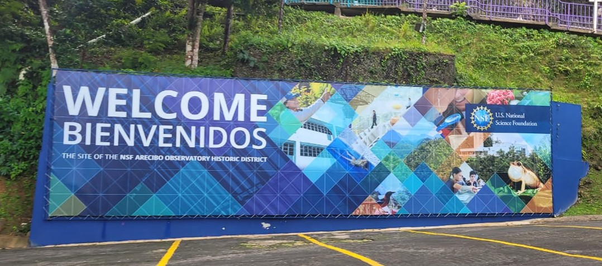
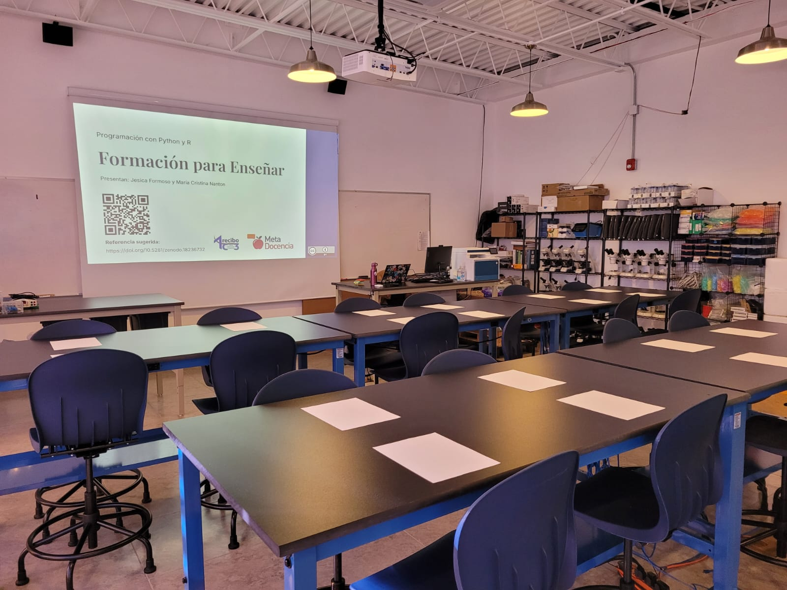
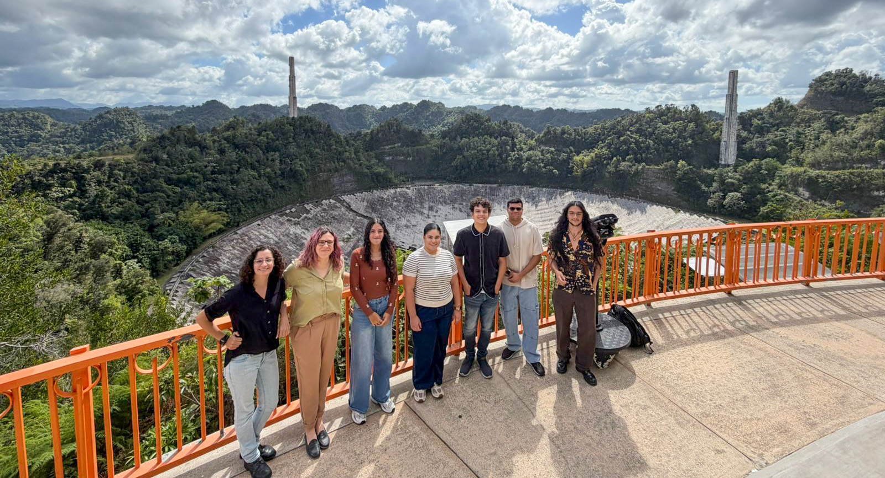

In January, I had the chance to facilitate an in-person edition of [Train the Trainer](https://metadocencia.org/en/post/2026/20260304-arecibo/), a MetaDocencia course aimed at people who teach — or want to teach — programming and data science. The workshop took place at the Arecibo C3 STEM Center in Puerto Rico between January 14 and 16 and was taught entirely in Spanish.

{fig-align="center"}

Over three days, we worked on things like identifying levels of prior knowledge in an audience, designing lessons with clear objectives, building open and safe learning environments, and practicing live coding in R and Python. The underlying premise is that many people with strong technical expertise have never had formal training in how to teach effectively.

{fig-align="center"}

Before the trip, the team updated the course content and materials — all openly licensed and available to explore, reuse, and adapt at [MetaDocencia's Workbench](https://metadocencia.github.io/formacion/), adapted from The Carpentries’ [Workbench](https://carpentries.github.io/workbench/).

It was a great experience to bring this to an in-person setting, and to connect with people in Puerto Rico who are thinking seriously about how to teach data and programming in Spanish-speaking contexts.

{fig-align="center"}
