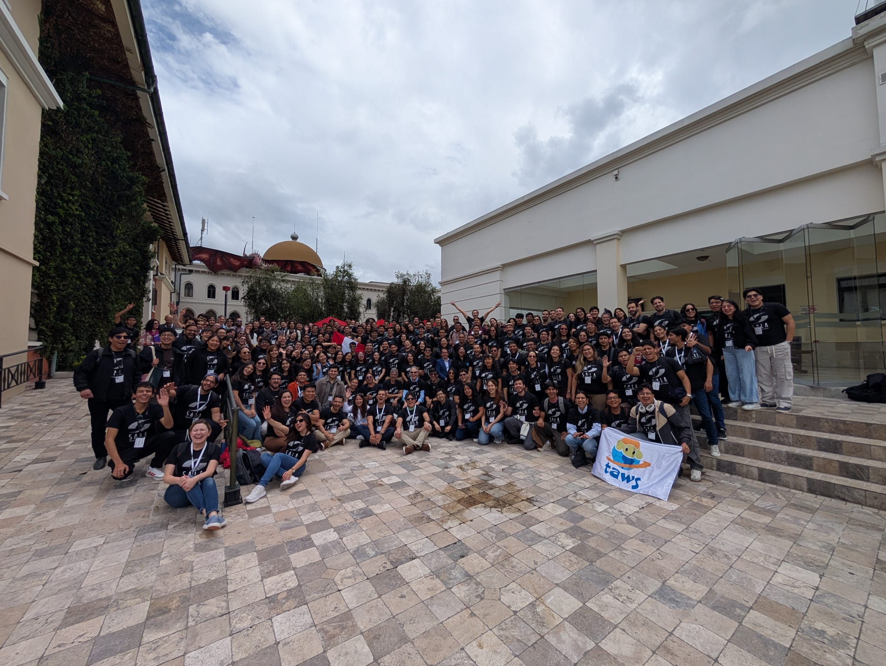
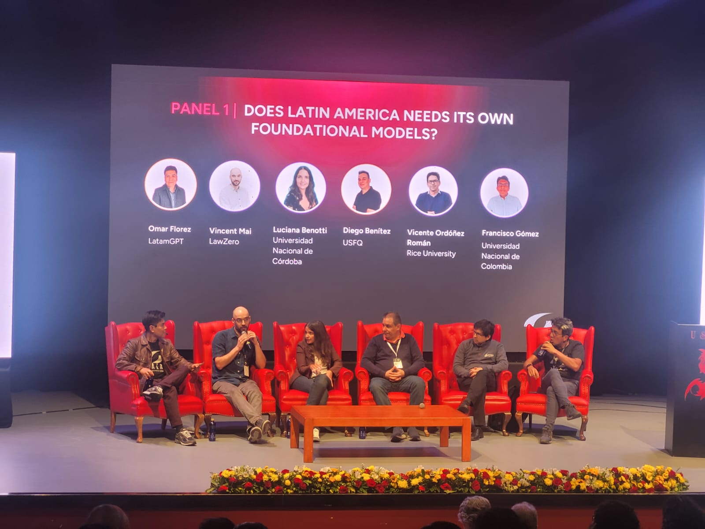
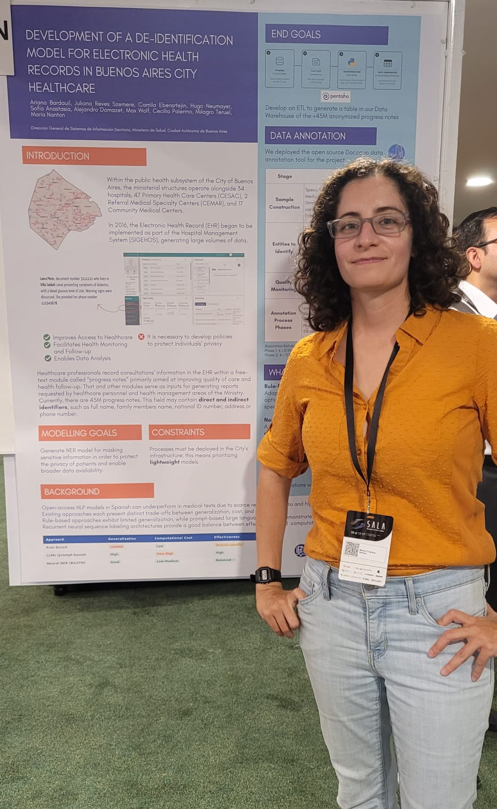

Last week, [SALA](https://www.salaconference.org/) — the Summit of AI in Latin America — wrapped up its 2026 edition, and I'm leaving thrilled to have been part of it.

SALA brings together young developers and researchers from the Latin American AI ecosystem: in four days of talks, posters, and conversations about what it means to work with AI in this region, with its specific constraints and contexts.

{fig-alt="Group picture of attendants of SALA AI 2026, about 60 people posing in the San Francisco de Quito University" fig-align="center"}

## Highlights

A few sessions that stood out for me personally:

**Nathan Lambert's talk on post-training of LLMs**

**Luciana Benotti's session on Human-LLM Collaboration** She presented, among other things, the [EDIA](https://ia.vialibre.org.ar/) and [HESEIA](https://ia.vialibre.org.ar/curso-de-formacion/) projects from Fundación Vía Libre — work that thinks carefully about how LLMs interact with users in Spanish and in contexts that are often left out of mainstream AI research. EDIA, in particular, is a tool that lets anyone — including secondary school students — inspect biases in language models without needing a technical background.

The **panel on foundational models in Latin America** was also worth attending — a grounded conversation about what it means to build (or not build) these systems from the region, with all the trade-offs that implies.

{fig-alt="Researchers Omar Florez, Vincent Mai, Luciana benotti, Diego Benítex and Francisco Gómez presenting in the panel \"Does Latin America need its own foundational models?\"" fig-align="center"}

## The poster

I also [had a poster accepted](https://mcnanton.github.io/talks/sala-ai-2026-anonymization/), which I presented on behalf of the team at **DGSISAN** (Dirección General de Sistemas de Información Sanitaria, Ministerio de Salud, CABA).

{fig-align="center"}

The project is about **de-identifying electronic health records** in the Buenos Aires City public health system. It was great to share the work and get feedback from people thinking about similar problems in other settings.

I thank the the SALA organizers for putting this excellent event together and for accepting the poster submission.

Hoping to cross paths again with more LatAm researchers and developers at the next edition of **Khipu** conference in 2027 🤞
