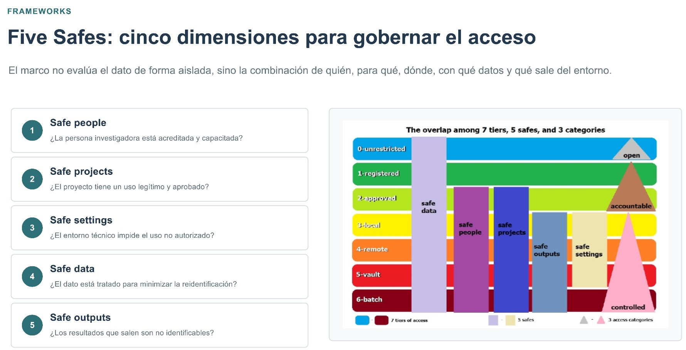

I gave this talk at the **Research Software Latinoamérica (RSLA26)** conference, together with Agustina Villarejo, Lautaro Ghezan, Cecilia Palermo and Sofía Anastasía..

The increasing digitization and centralization of health data, along with its growing secondary use for scientific and technological research within healthcare organizations, has created a need for policies that regulate access while ensuring confidentiality, data integrity, and ethical responsibility.

Drawing on our day-to-day experience within a public-sector management team in the City of Buenos Aires, Argentina, the talk examined the challenges involved in providing researchers with access to large-scale, sensitive health data.

We focused on three main dimensions. First, we reviewed the regulatory framework governing the processing and use of health information for research. Second, we discussed conceptual and operational frameworks for working securely with sensitive data, including the **Five Safes** model, which considers safe people, projects, data, settings, and outputs.

{fig-align="center"}

Finally, based on common data-access and data-use scenarios, we identified current gaps, opportunities for improvement, and relevant examples that could inform the implementation of secure research environments for health data in the public sector.

- Link to the [slides](https://zenodo.org/records/22777869) (in spanish)
