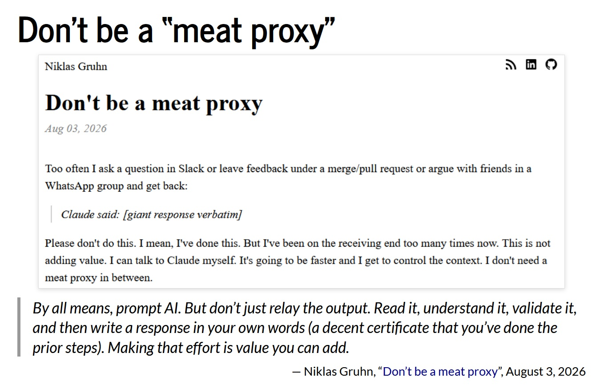
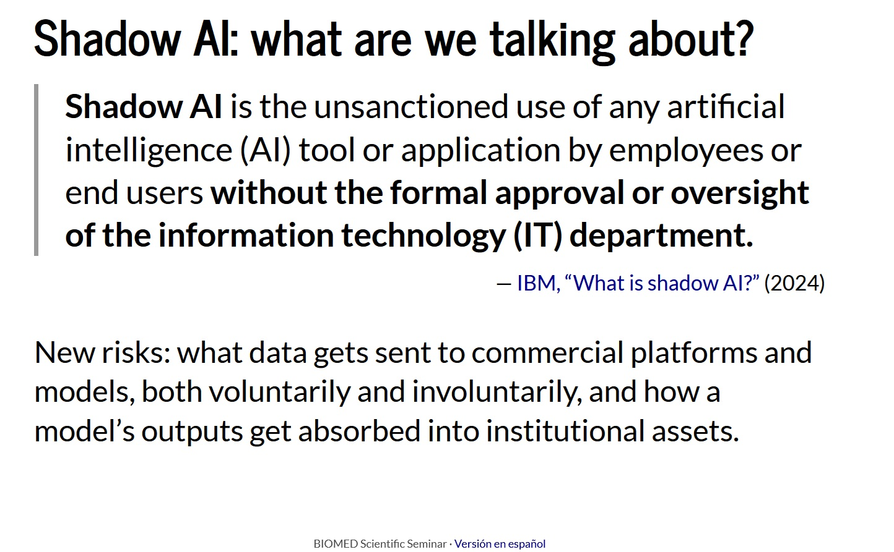
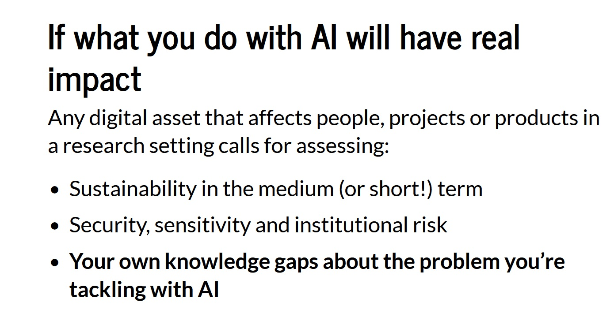

I gave a talk at the Scientific Seminar of the Instituto de Ciencias Biomédicas (BIOMED) at the Universidad Católica Argentina (UCA): *"Vibe coding e IA generativa: autonomía, datos sensibles y sostenibilidad en entornos de investigación"*. The session was hybrid, held in BIOMED's seminar room on the Papa Francisco campus and online.

Vibe coding, a term coined by Andrej Karpathy in February 2025, describes building software by giving an AI instructions in natural language, without necessarily writing or understanding all the code. The first part of the talk looked at how this is expanding the autonomy of technical and non-technical people in research. Prototypes now take days or hours, with fewer intermediaries, but the gap between prototype and production brings its own questions: how to integrate the tool with institutional platforms and login, whether the data users enter is safe, and how hard it would be to deploy it in the organization's infrastructure.

{fig-align="center"}

The second part focused on working with sensitive data. Beyond whatever regulations apply in each region or institution, I proposed three questions to ask before starting: can a person be re-identified from the data, who will access it and in what environment, and what expectations exist about how it is handled.

{fig-align="center"}

We mapped where data can leave (prompts, shared folders an AI can read, terms of service, AI-generated apps with public URLs and unprotected databases, and integrations with Drive, email, or browser extensions) and reviewed the policies of Harvard, Penn State, and Sheffield. From there, we discussed some criteria before using AI with sensitive data.

To close, I argued that any digital asset affecting people, projects, or research outputs has to be evaluated for sustainability, security, and institutional risk, and also against our own knowledge gaps about the problem we are using AI to solve.

{fig-align="center"}

- Link to the [slides](https://mcnanton.github.io/UCA_seminario_IA_2026/)
