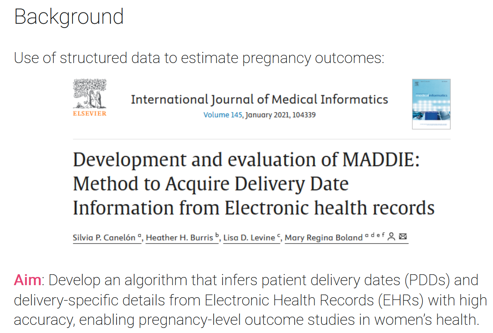
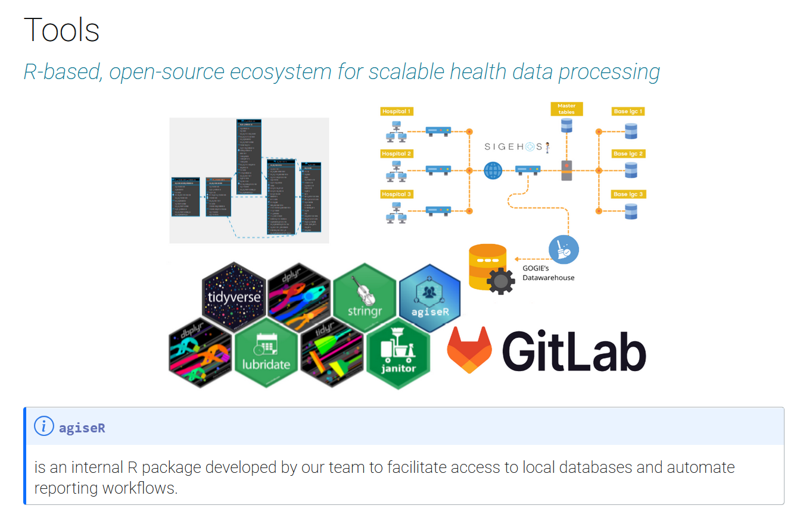

Together with Carolina Mengoni Goñalons and Juliana Reyes Szemere, we presented at the Government Advances in Statistical Programming (GASP) 2025 conference on a natural language processing algorithm developed to detect and characterize pregnancies from Electronic Health Records in the Buenos Aires City public health system.

Pregnancy status is not explicitly recorded in any dedicated section of SIGEHOS, the Hospital Information Management System in use since 2016. That means key information — pregnancy start and end dates, estimated delivery date, gestational age at first visit — has to be inferred from structured and unstructured fields scattered across the EHR.

{fig-align="center"}

Using open-source tools in R, we built an algorithm that applies data mining techniques, rule-based processing, and regular expressions to extract and classify that information at scale.

{fig-align="center"}

The work is aimed at researchers and professionals dealing with large-scale population data where the information of interest is non-structured, dispersed, and difficult to locate.

-   Link to our [slides](https://mcnanton.github.io/GASP_pregnancy_detection_2025/#/title-slide)
