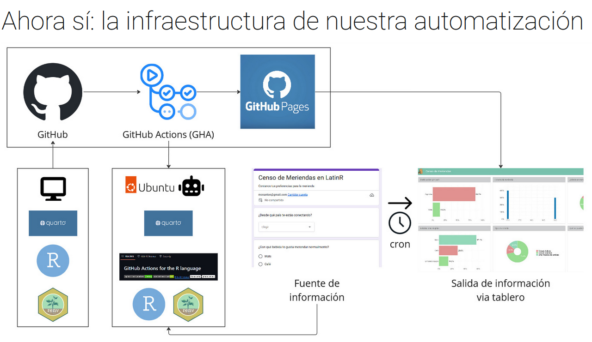
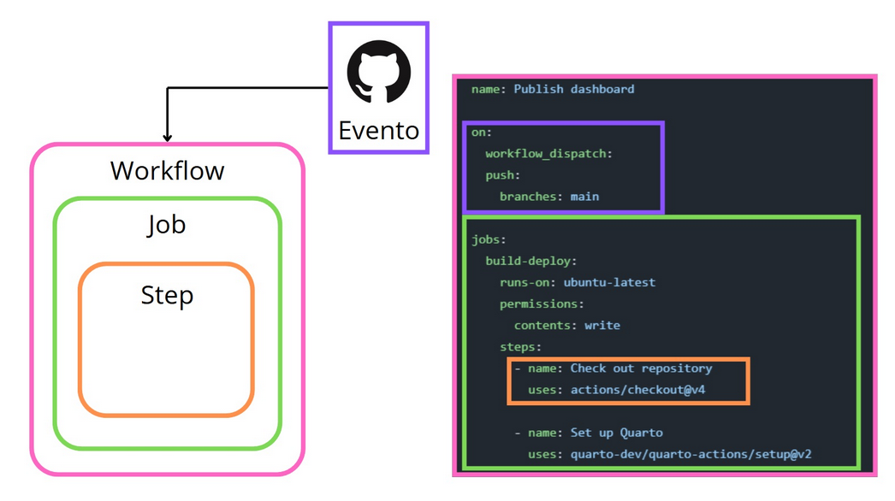

Together with [Jesica Formoso](https://jformoso.github.io/), we ran a workshop at LatinR 2025 on building automated report publishing pipelines with Quarto and GitHub Actions.

{fig-align="center"}

The workshop walked participants through setting up a complete workflow from scratch: managing dependencies with `renv`, writing a GitHub Actions YAML file, scheduling periodic runs with cron expressions, and handling credentials securely with GitHub Secrets.

{fig-align="center"}

By the end of the session, everyone had a functioning pipeline that pulls data from a form, renders a Quarto site, and publishes it automatically to GitHub Pages.

-   📊 Slides: [LINK](https://mcnanton.github.io/LatinR_workshop_quarto_gha_2025/#/title-slide)
-   💻 Practice repository: [LINK](https://github.com/JFormoso/censo-meriendas)
